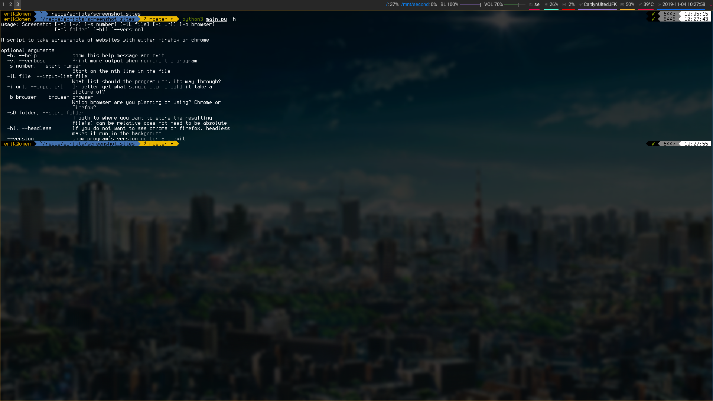

# Screenshot Script

## Checklist before continuing
- [x] Do you wish to have images of sites to remember what you did?
- [x] Do you have a list of sites or just a single item?
- [x] Do not have firefox but chrome?
- [x] Or maybe the opposite?
<br>
If none of the items above applies then turn around now.

## Description
The script was built for users that want to remember websites they have visited for a certain project.

#### Assumption
You have coded something a program or a script but don't really remember from where you have gotten parts of the code, 
and want to revisit those pages but you may have cleared the history or changed to another computer.

#### Solution
The idea behind this script is that it should be easy to take a picture of a website and put it in the same directory 
as the project. When using the script it will automatically turn the url to be the name of the file when it takes an 
image of the website.
The script can run in the background by supplying the ```--headless``` flag when calling the script. 
It can also be run in multiple instances and uses only one tab per call on script and therefore as 
little memory as possible.

### Flags
Short | Long | Parameter Value | Description
------|------|-----------------|-------------
-v | --verbose | None | To get more output from the program
-s | --start | number | Takes a number and uses it to start from that position in the list
-iL | --input-list | file | A file with lines to read, where each line is a url to a website
-i | --input | url | A single url to take a picture of
-b | --browser | Chrome or Firefox | A webbrowser to use, the current available browsers are in the column left of this one.
-sD | --store | folder | Where should the script store the images taken of the websites?
-hl | --headless | None | To make the browser run in background.
None | --version | None | Display the version of the script and exit.
-h | --help | None | Display the program help and exit.

### Examples to start the script
    python3 main.py -b firefox -i http://localhost/help.php -sD ./
    python3 main.py -b firefox -iL input.txt --store path/to/folder --headless

## Examples
Unfortunately I can not take any picture of the script while it is running yet since I have not yet implemented verbose 
flag and no progress bar have been added when supplying a large file to show where in the file it is. 
See [TODO](TODO.md) for a list over stuff that needs to be added, if you have ideas please create a new [issue](https://github.com/erikkamph/screenshot_sites/issues).

